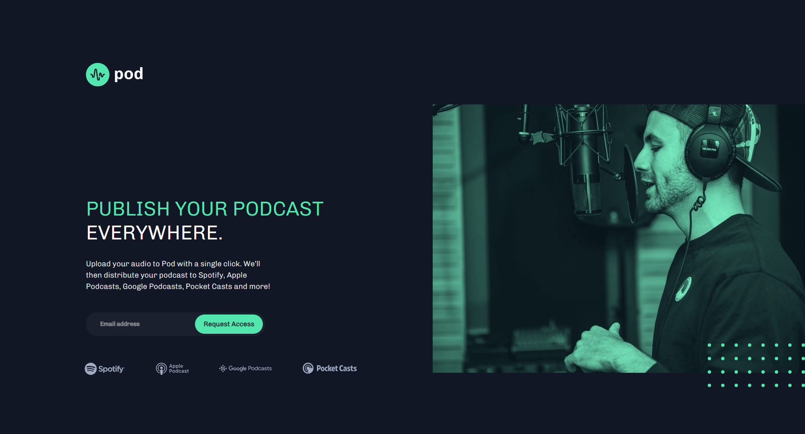
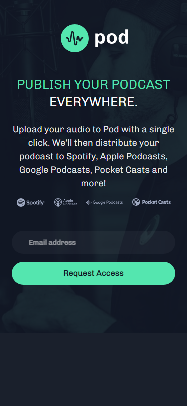

# Frontend Mentor - Pod request access landing page solution

This is a solution to the [Pod request access landing page challenge on Frontend Mentor](https://www.frontendmentor.io/challenges/pod-request-access-landing-page-eyTmdkLSG). Frontend Mentor challenges help you improve your coding skills by building realistic projects.

## Table of contents

- [Overview](#overview)
  - [The challenge](#the-challenge)
  - [Screenshot](#screenshot)
  - [Links](#links)
- [My process](#my-process)
  - [Built with](#built-with)
  - [What I learned](#what-i-learned)
  - [Continued development](#continued-development)
  - [Useful resources](#useful-resources)
- [Author](#author)
- [Acknowledgments](#acknowledgments)

## Overview

### The challenge

Users should be able to:

- View the optimal layout depending on their device's screen size
- See hover states for interactive elements
- Receive an error message when the form is submitted if:
  - The `Email address` field is empty should show "Oops! Please add your email"
  - The email is not formatted correctly should show "Oops! Please check your email"

### Screenshot

### Links

- Solution URL: https://github.com/dors001/pod-request-access-landing-page
- Live Site URL: https://pod-request-access-landing-page-beta.vercel.app/

## My process

### Built with

- Flexbox
- CSS Grid
- Mobile-first workflow
- [React](https://reactjs.org/) - JS library
- [Chakra UI](https://chakra-ui.com/) - For styles

### What I learned

I used this project to learn the basics of React and Chakra UI.
This was a great experiance because it was challenging to a point where i need to figure out how to use styles with chakra ui and deal with the constraints of React.
while it's not pure HTML and CSS it is simplify the process by emphasizing using components.
although it was an introduction level of add functionality only on email validation, i got a lot of insight as to how React is implementing said methods, which i find a bit tricky at first but the more i practice with it the more fluide it will become.
In conclusion this project was a great way to get a little bit more comfortable with React, which was my main focus.

### Continued development

The following projects will be more challenging because i'll focuse on creating more complex functions and styled components, my goal is to be knowledgeable enough with React to build web application, APIs and more elegent web sites.

## Author

- Frontend Mentor - [@dors001](https://www.frontendmentor.io/profile/dors001)

## Acknowledgments

I'm on my journey to become a freelance frond-end developer, and i wouldn't get this far without the teaching of Mosh Hamedani - https://codewithmosh.com/
He's very well versed in computer science. His a pleasant and knowladgeable teacher that shows planty of examples and have a way of simplfying each subject to make it understandable and easy.
If you need to get a good feel for any subject realated to CS i highly recommend you to checkout Code With Mosh https://codewithmosh.com/
